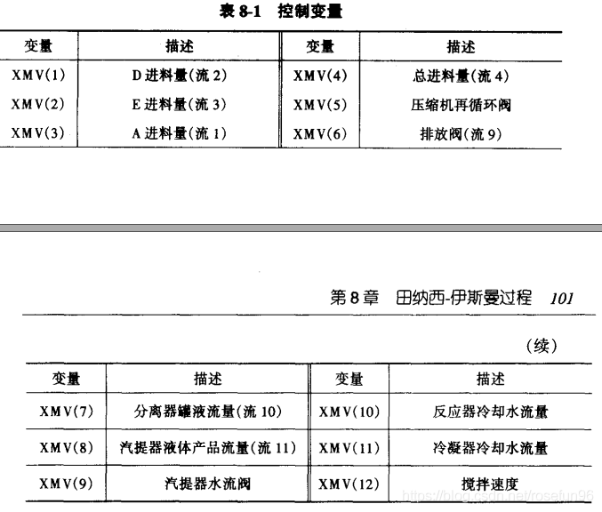
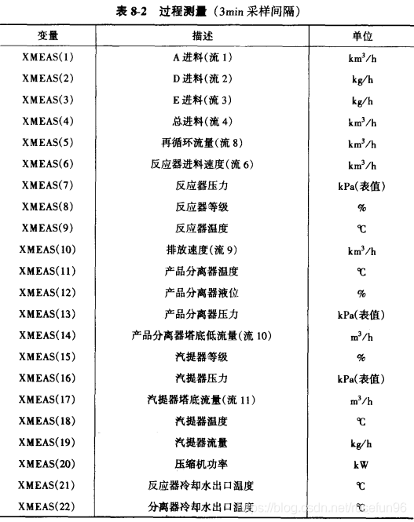
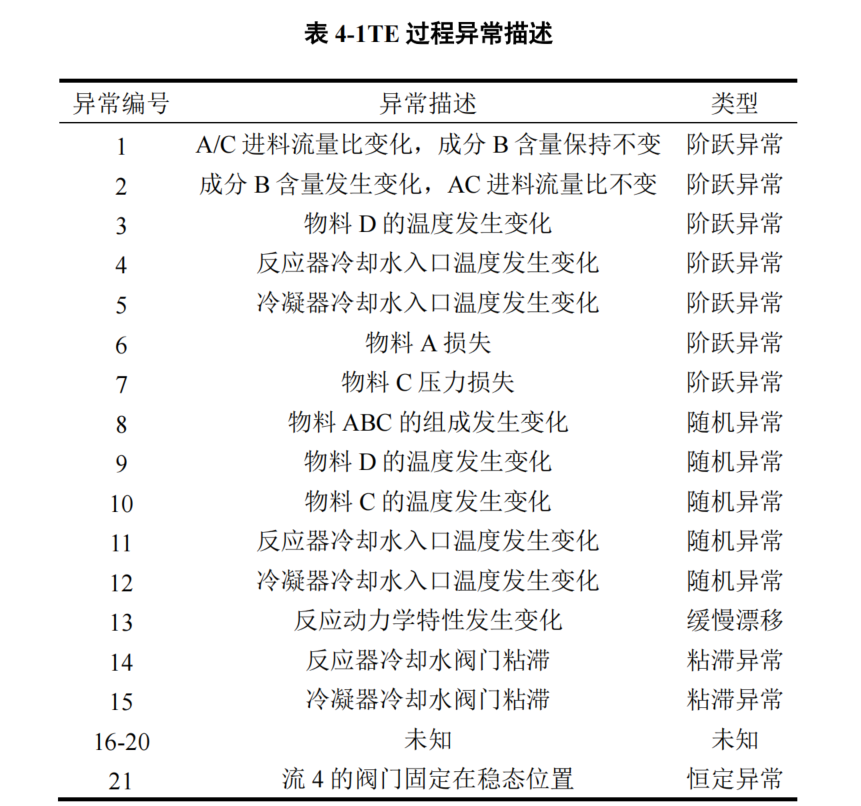

# TE数据构成

- 整个TE数据集由**训练集**和**测试集**构成，TE集中的数据由**22**次不同的仿真运行数据构成，TE集中每个样本都有**52**个观测变量。包括41个过程变量和11个控制变量。
- **采样频率**：3min/次，每小时采样20次

- **d00.dat至d21.dat**为==训练集==样本，**d00_te.dat至d21_te.dat**为==测试集==样本。训练集25h，`shape=(500,52)`或`shape=(480,52)`，测试集48h，`shape=(960,52)`

- **正常工况**：d00.dat和d00_te.dat，d00.dat

- **故障**：d01.dat至d21.dat，每个训练集\测试样本代表一种故障。
- - 训练集故障在1h(20)的时候引入，正常应采集500个观测值，但是他是从故障引入后才开始采集的，也就是共480条样本。
  - 测试集故障在8h(160)的时候引入，共采集960个观测值，其中前160个观测值为正常数据。

# 变量介绍

# 故障描述

- 第一类是由于过程变量的阶跃变化所产生的异常包括异常编号 1-7；
- 第二类是由于过程变量的变化性增大造成的包括异常编号 8-12；
- 第三类是由于变量的缓慢变化导致的异常包括异常编号 13；
- 第四类是阀门粘滞导致的异常包括异常编号 14、15；
- 第五类为未知异常包括异常编号 16-20

